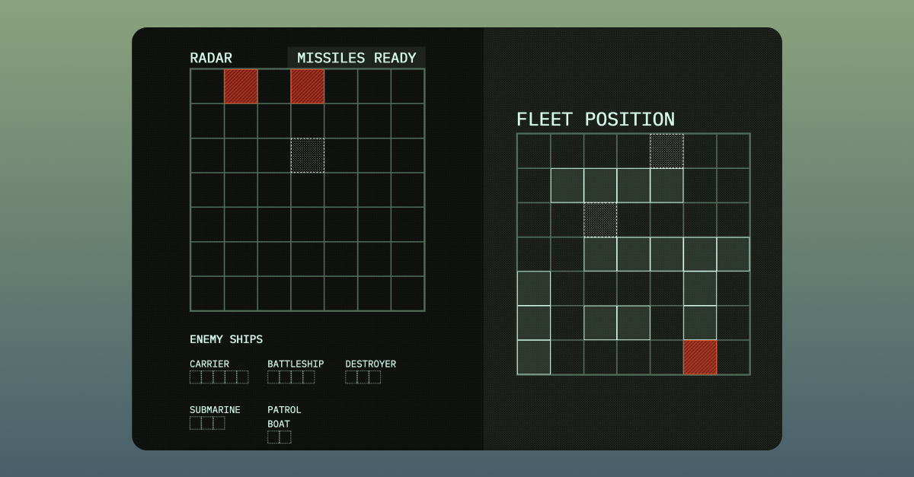

# TOP Javascript Course Project - Battleship

    

[Play Battleship Game](emhng.github.io/odin-battleship/)

## Playing locally

If you'd like to play locally:

1. Download the repo by clicking on Code -> Download Zip
2. Unzip the downloaded repo and open the folder
3. Open the Dist folder and click on index.html

## Project Objectives

Using the test driven development process, create a battleship game.

Your game must include the following:

- Use factory functions for ships, gameboards, and players.
- A CPU for the player to play against

## Learnings

Following the project brief on being selective on what factory function or module each function should go under was good practice. I feel like I have a better understanding of how to organize my code now.
